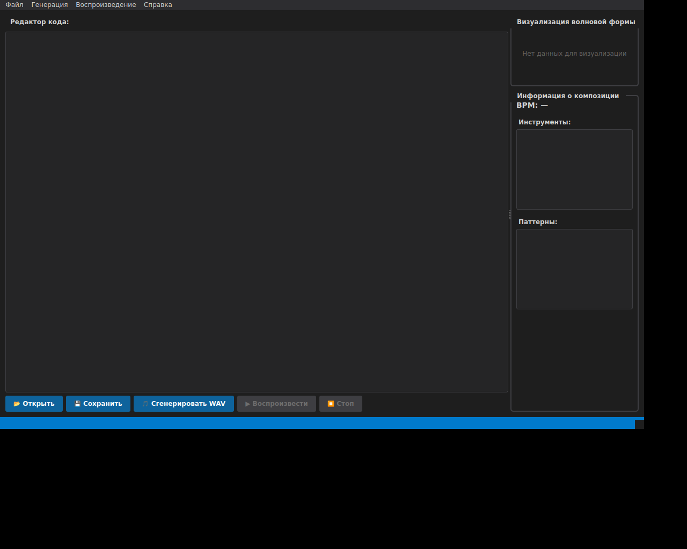
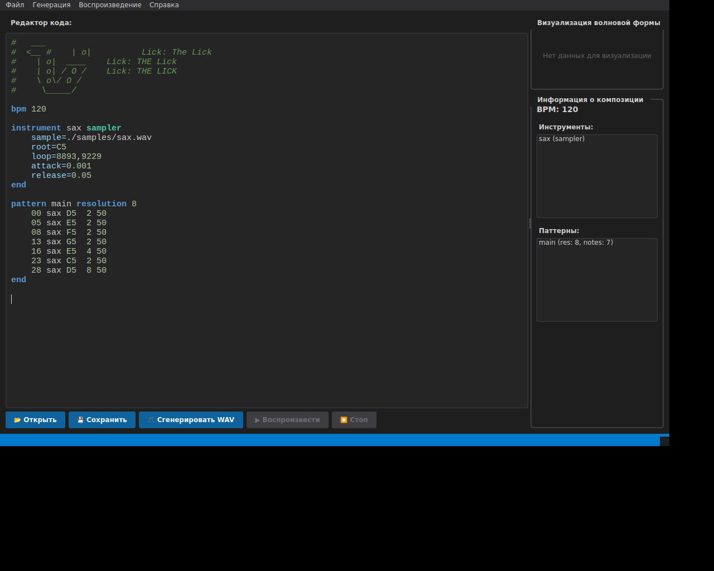

# ITMO Loops GUI

Графический интерфейс пользователя для ITMO Loops на основе Qt6.

## Возможности

### Редактор кода
- Подсветка синтаксиса для формата ITMO Loops
- Поддержка всех ключевых слов: `bpm`, `instrument`, `pattern`, `effect`, `end`, `resolution`
- Цветовое выделение типов инструментов: `sampler`, `sine`, `triangle`, `square`
- Подсветка эффектов: `gain`, `echo`, `tremolo`
- Подсветка нот (C0-B9) и комментариев
- Монохромный шрифт для удобного редактирования

### Панель управления
- **Открыть файл** - загрузка .txt файла с композицией
- **Сохранить** - сохранение текста в файл
- **Сгенерировать WAV** - генерация аудио файла из композиции
- **Воспроизвести** - воспроизведение сгенерированного аудио
- **Стоп** - остановка воспроизведения

### Визуализация
- Визуализация волновой формы сгенерированного аудио с помощью QPainter
- Отображение амплитуды и формы сигнала в реальном времени

### Боковая панель
Автоматическое отображение информации о композиции:
- Текущий BPM
- Список инструментов с их типами
- Список паттернов с количеством нот и разрешением

### Дополнительные возможности
- **Drag & Drop** - перетаскивание .txt и .wav файлов в окно приложения
- **Тёмная тема** - современный тёмный интерфейс
- **Строка состояния** - информация о текущих операциях
- **Полностью русский интерфейс**

## Сборка

### Требования
- Qt6 (Core, Widgets, Multimedia)
- CMake 3.24+
- C++20 компилятор

### Linux (Ubuntu/Debian)
```bash
# Установить зависимости
sudo apt-get install qt6-base-dev qt6-multimedia-dev

# Собрать проект
mkdir build && cd build
cmake ..
make -j4

# Запустить GUI
./gui/itmoloops_gui
```

### macOS (с Homebrew)
```bash
# Установить зависимости
brew install qt6

# Собрать проект
mkdir build && cd build
cmake ..
make -j4

# Запустить GUI
./gui/itmoloops_gui
```

## Использование

1. **Открыть существующий файл**: Нажмите кнопку "Открыть" или перетащите .txt файл в окно
2. **Редактировать композицию**: Введите или измените код в редакторе
3. **Просмотреть информацию**: Боковая панель автоматически обновляется при изменении кода
4. **Сгенерировать аудио**: Нажмите "Сгенерировать WAV" и выберите место сохранения
5. **Воспроизвести**: Нажмите "Воспроизвести" для прослушивания результата

## Горячие клавиши

- `Ctrl+O` - Открыть файл
- `Ctrl+S` - Сохранить файл
- `Ctrl+G` - Сгенерировать WAV
- `Ctrl+P` - Воспроизвести
- `Space` - Остановить воспроизведение
- `Ctrl+Q` - Выход

## Структура файлов

```
gui/
├── CMakeLists.txt           # Конфигурация сборки
├── main.cpp                 # Точка входа приложения
├── mainwindow.hpp           # Заголовочный файл главного окна
├── mainwindow.cpp           # Реализация главного окна
├── syntaxhighlighter.hpp    # Заголовочный файл подсветки синтаксиса
├── syntaxhighlighter.cpp    # Реализация подсветки синтаксиса
├── waveformwidget.hpp       # Заголовочный файл виджета визуализации
└── waveformwidget.cpp       # Реализация виджета визуализации
```

## Скриншоты

### Главное окно


### Редактор с подсветкой синтаксиса


## Технические детали

### Использованные Qt модули
- **Qt6::Core** - базовая функциональность
- **Qt6::Widgets** - элементы интерфейса
- **Qt6::Multimedia** - воспроизведение аудио

### Интеграция с библиотекой
GUI использует существующую библиотеку `itmoloops_lib` для:
- Парсинга композиций (`parseScore`)
- Генерации WAV файлов (`run_itmoloops`)

### Цветовая схема подсветки
- **Ключевые слова** - синий (#569CD6)
- **Типы инструментов** - бирюзовый (#4EC9B0)
- **Эффекты** - желтоватый (#DCDCAA)
- **Ноты** - зеленоватый (#B5CEA8)
- **Комментарии** - темно-зеленый (#6A9955, курсив)
- **Параметры** - голубой (#9CDCFE)
- **Числа** - зеленоватый (#B5CEA8)
